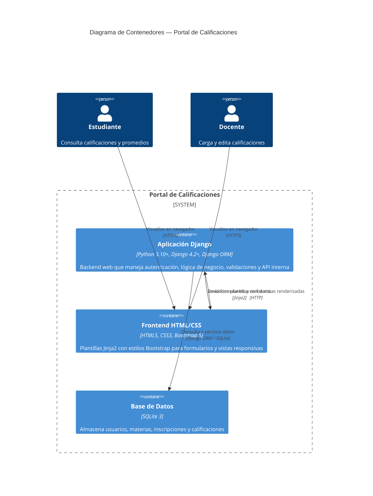
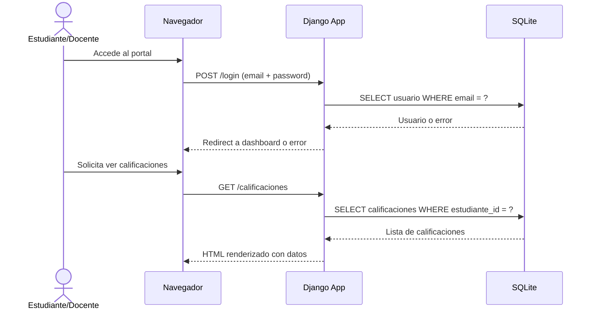

# C4 Contenedores — Portal de Calificaciones

> **Nivel 2 — Diagrama de Contenedores**
> Última actualización: 2026-09-22 | Ref: SPEC v2, ADR-001, ADR-002, ADR-003

## Descripción

Este diagrama desglosa el sistema en sus contenedores principales: la aplicación Django, la base de datos SQLite, y los componentes de frontend que interactúan a través del navegador.

## Diagrama

## Contenedores

### 1. Aplicación Django (`django_app`)

| Aspecto | Detalle |
|---|---|
| Tecnología | Python 3.10+, Django 4.2+ |
| Responsabilidad | Backend completo: autenticación (RF-01 a RF-03), lógica de negocio (RF-04 a RF-17), validaciones, control de acceso por roles |
| Módulos principales | `portal_calificaciones/` (core), `usuarios/` (autenticación y roles), `calificaciones/` (CRUD de notas) |
| Protocolo | HTTP interno, Sirve HTML renderizado |

### 2. Frontend HTML/CSS (`html_css`)

| Aspecto | Detalle |
|---|---|
| Tecnología | HTML5, CSS3, Bootstrap 5 |
| Responsabilidad | Interfaz de usuario responsiva: formularios de login, tablas de calificaciones, formularios de carga |
| Framework | Bootstrap 5 (CDN o local, según ADR) |
| Protocolo | HTTPS (entregado por Django) |

### 3. Base de Datos (`db`)

| Aspecto | Detalle |
|---|---|
| Tecnología | SQLite 3 (archivos `.db`) |
| Responsabilidad | Persistencia de datos: usuarios, materias, inscripciones, calificaciones |
| Acceso | Exclusivamente vía Django ORM (sin raw SQL, per ADR-001 y .opencoderules) |
| Migraciones | Django migrations para schema versionado |

## Protocolos y flujo

## Restricciones de contenedores

- **Sin APIs externas:** No hay comunicación con servicios de terceros (Non-Goal)
- **Sin JavaScript frameworks:** Solo vanilla JS si se justifica en ADR futuro
- **SQLite en desarrollo:** PostgreSQL es viable en producción (ADR-001 menciona portabilidad)
- **Todo por HTTP:** No hay WebSocket ni conexiones persistentes

## Trazabilidad

| Elemento | Fuente |
|---|---|
| Django App | ADR-001 (stack tecnológico), SPEC.md Sección 4 |
| Frontend Bootstrap | SPEC.md Sección 4, ADR-001 |
| SQLite | ADR-001, ADR-003 |
| Django ORM | ADR-001, .opencoderules Sección 3 |
| Sin APIs externas | SPEC.md Non-Goals |
