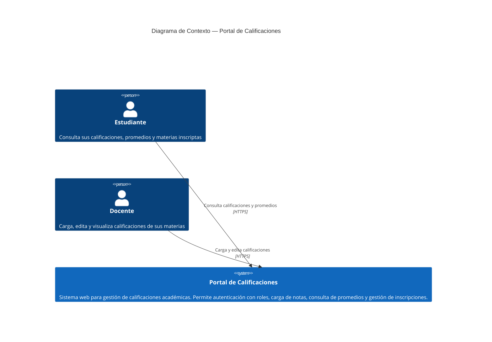

# C4 Contexto — Portal de Calificaciones

> **Nivel 1 — Diagrama de Contexto**
> Última actualización: 2026-09-22 | Ref: SPEC v2, ADR-001, ADR-002

## Descripción

El Portal de Calificaciones es un sistema web que permite a estudiantes consultar sus notas y a docentes cargar y gestionar calificaciones dentro del instituto IES 9-018.

## Diagrama

## Actores

| Actor | Rol | Interacciones principales |
|---|---|---|
| Estudiante | Usuario autenticado con rol `estudiante` | Consulta sus calificaciones por materia, ve promedio general, visualiza materias inscriptas |
| Docente | Usuario autenticado con rol `docente` | Visualiza materias que dicta, carga calificaciones (formulario o CSV), edita calificaciones propias, ve listas de estudiantes |

## Sistemas externos

Actualmente **no hay sistemas externos** integrados. La SPEC define como Non-Goal la integración con servicios externos (email, SMS, APIs de terceros). El portal opera de forma autónoma.

## Restricciones de contexto

- Todos los usuarios deben autenticarse con email y contraseña (RF-01 a RF-03)
- Los roles se asignan automáticamente al crear la cuenta: `estudiante` o `docente`
- No existe recuperación de contraseña (Non-Goal)
- No existen notificaciones externas (Non-Goal)

## Trazabilidad

| Elemento | Fuente |
|---|---|
| Estudiante | SPEC.md RF-01 a RF-08 |
| Docente | SPEC.md RF-09 a RF-14 |
| Autenticación | SPEC.md RF-01 a RF-03, ADR-001 |
| Sin sistemas externos | SPEC.md Non-Goals |
